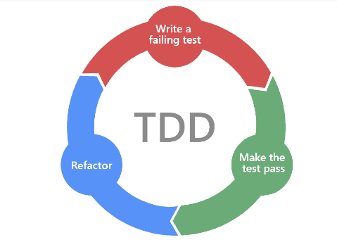

---

### 편의상 커밋을 red green blue와 같은 명칭으로 할 예정

---

# TDD 순서
1. red(테스트 케이스 작성)
2. green(테스트가 통과하게 코드 구현)
3. blue(리팩토링) -> 테스트 케이스를 늘려가면서 리팩토링

---

### 1차  최종 목표
 - Calc.run("((3 + 5) * 5 + -10) * 10 / 5");
